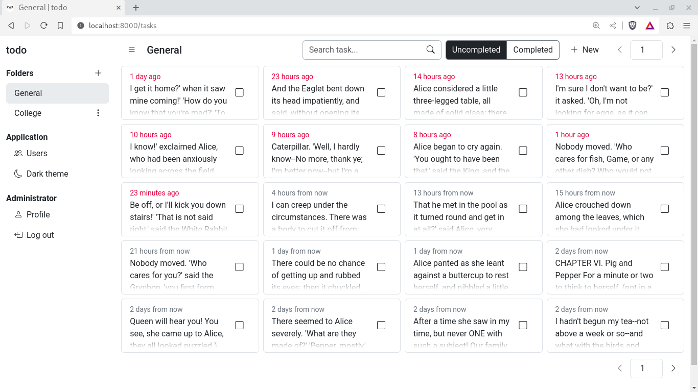

# todo
A to-do list app written in Laravel 10, which I use as a template for my other Laravel projects. Work in progress.


## Installation
1. Create a database
2. Copy the ```.env.example``` file and rename it to ```.env```
3. Edit the ```.env``` file to match your environment configuration
4. Execute
```bash
composer update && \
npm install && \
npm run build && \
php artisan migrate:fresh --seed && \
php artisan key:generate && \
php artisan storage:link
```
## Usage
Execute
```bash
php artisan serve
```
then visit http://localhost:8000 (or whichever port ```artisan``` serves on) on your browser.
